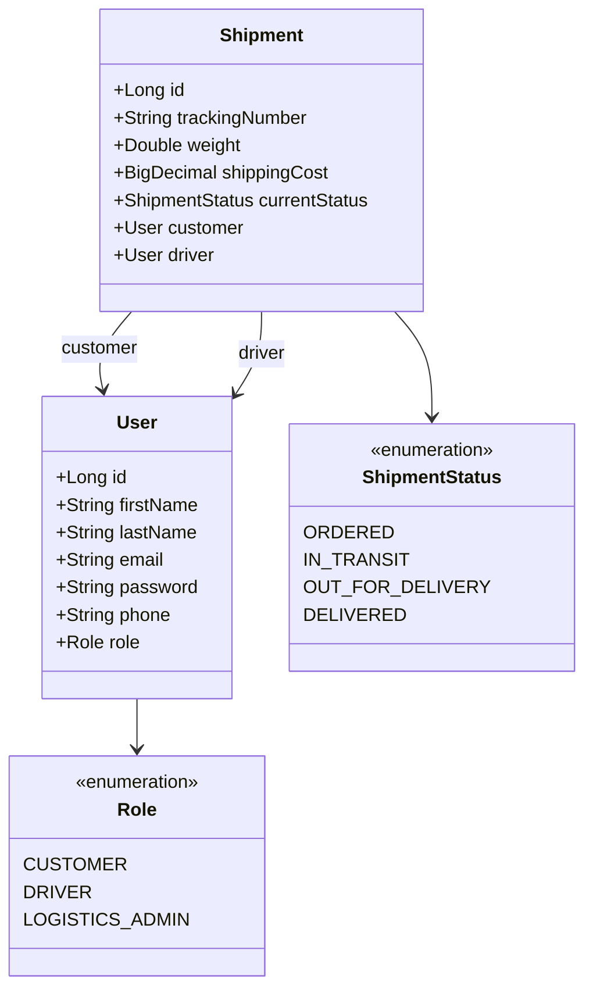

# Logistics Service 📦🚀

A high-performance, enterprise-grade eCommerce **Logistics & Delivery RESTful API** built with **Java 17** and **Spring Boot 3**. This system handles shipment initialization, automated shipping rate compilation based on weight matrices, synchronized package routing allocation, and automated data logging through transactional events.

The project implements **Level 3 of the Richardson Maturity Model (HATEOAS)** and features full historic audit tracking using Hibernate Envers, backed by a production-ready PostgreSQL environment.

---

## 🛠️ Tech Stack & Key Architectures

*   **Backend Engine:** Java 17 (LTS) & Spring Boot 3.x
*   **Database Management:** PostgreSQL / Supabase Core
*   **Persistence & Auditing:** Spring Data JPA + Hibernate Envers (Automated `_aud` mirror schema ledger)
*   **Perimeter Security:** Stateless Spring Security Architecture powered by JSON Web Tokens (JJWT 0.12.6)
*   **Hypermedia Controls:** Spring HATEOAS (Exposing reactive navigation links)
*   **Event Handling:** Decoupled asynchronous event processing using Spring `@Async` Events
*   **API Standardization:** OpenAPI 3 & Interactive Swagger UI Engine
*   **Testing Suite:** JUnit 5, Mockito Core, JaCoCo, and **Testcontainers** (Ephemeral Docker PostgreSQL integration)

---

## 🏗️ Domain Data Architecture



---

## 🚀 Key Technical Features

1. **HATEOAS:** All core entities dynamically wrap state transitions into hypermedia controls (`links`), enabling clients to consume API nodes fluidly.
2. **Automated Historic Audit Logging:** Using Hibernate Envers, any mutation down the delivery stream triggers an asynchronous shadow insert within the `logistics.shipments_aud` ledger table, tracking chronological variations without manual logging overhead.
3. **Decoupled Asynchronous Events:** Thread-isolated notification routines are dispatched immediately after shipment mutations using Spring's `ApplicationEventPublisher`, preserving fast HTTP response cycle times.
4. **Flattened Conditional Web Filters:** The custom JWT authentication context features fully-flattened boundary loops, avoiding heavy logical operators (`||`, `&&`), maximizing structural predictability and code maintainability.

---

## 🌐 Core API Endpoints

### Authentication Gateway
*   `POST /api/auth/register` - Private registration for Customers, Drivers, and Administrators.
*   `POST /api/auth/login` - Secure login endpoint returning a dynamic cryptographic Bearer Token.

### Shipment Registry
*   `POST /api/shipments` - *Secured (LOGISTICS_ADMIN only)*. Registers a parcel order and auto-calculates baseline shipping tariffs.
*   `PUT /api/shipments/{id}/status` - *Secured (DRIVER only)*. Fluid route status mutations (`IN_TRANSIT`, `DELIVERED`) with delivery logs.
*   `GET /api/shipments/track/{trackingNumber}` - *Public Gateway*. Real-time distribution tracing matrix.

---

## 🧪 Testing Strategy & Enterprise Quality

The architecture enforces an aggressive code verification standard verified through **JaCoCo**, targeting **100% Code Coverage**.

*   **Unit Tests:** Isolated business component assertions using Mockito mocks with deep type inference, bypassing external hardware dependencies.
*   **Integration Tests:** End-to-end integration boundaries executed against an isolated, ephemeral Docker container using **Testcontainers (PostgreSQL)**, mimicking production-grade database constraints.

### Executing the Verification Suite

Run the full collection of unit tests, database container integration pipelines, and compile the interactive coverage dashboard via Maven:

```bash
mvn clean test
```

To review the interactive coverage breakdown, open the compiled website in your browser:
```bash
open target/site/jacoco/index.html
```

---

## ⚙️ Configuration & Environment Setup

The service isolates volatile deployment values using system properties with robust fallbacks. Ensure you review the `src/main/resources/application.yaml` layout:

```yaml
application:
  security:
    jwt:
      secret-key: \${JWT_SECRET:YOUR_SECURE_BASE64_DEV_SECRET_KEY}
      expiration: \${JWT_EXPIRATION:86400000}
  logistics:
    rates:
      base-rate: 5.50
      rate-per-kg: 2.25
```

### Local Development Quickstart

Spin up a localized isolated database image effortlessly utilizing Docker Compose:

```bash
docker compose up -d
```
